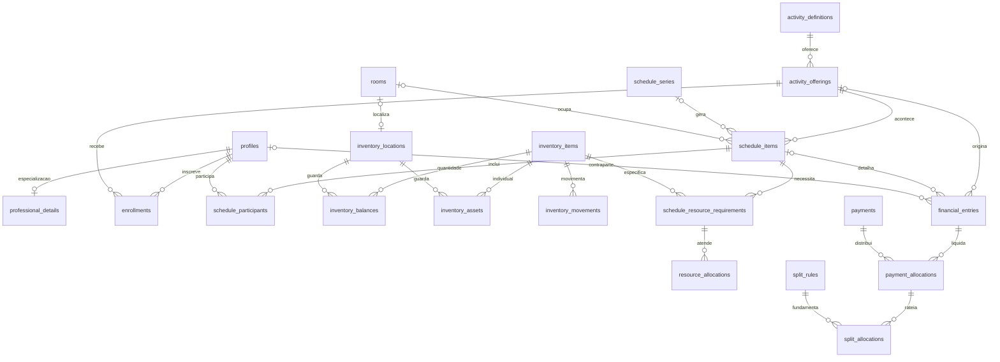
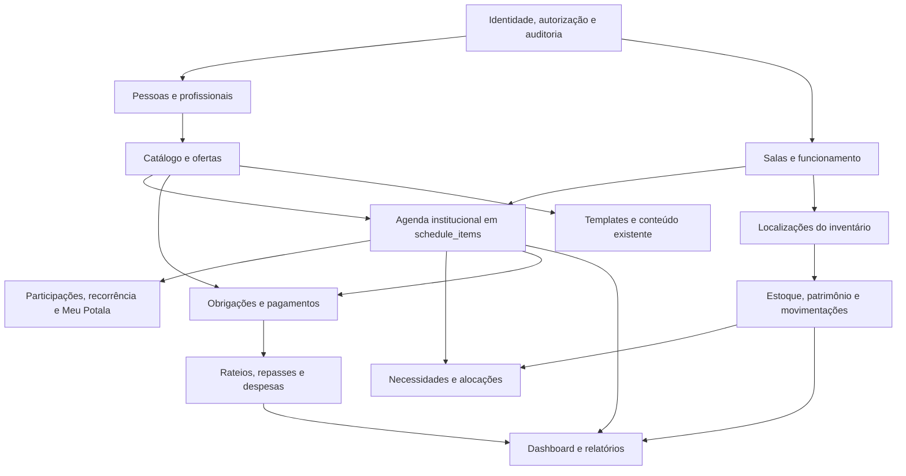

# Portal Potala — auditoria do /admin e proposta de central operacional

Data: 16/09/2026. Primeira entrega: levantamento e arquitetura; nenhuma funcionalidade, tabela, migração ou endpoint foi implementado nesta etapa.

## Síntese da decisão

O Portal já tem um editor de Jornada com repositório Supabase, autenticação administrativa, perfis pessoais, inscrições, progresso de cursos e agenda pessoal. **Essas estruturas serão reaproveitadas.** As telas de Salas, Financeiro, Atendimentos e Usuários no `/admin` são demonstrações estáticas, não sistemas operacionais completos.

A recomendação é ampliar o portal existente, com uma pessoa-base em `profiles`, uma agenda canônica em `schedule_items`, inscrições em `enrollments` e o editor atual preservado. Salas, inventário e domínio financeiro precisam de persistência e regras novas. Curso, atendimento, evento, atividade e locação serão tipos de uma oferta operacional compartilhada, não cinco cadastros independentes.

### Escopo e limites da evidência

- Base principal: `wind_theme`, commit `f5ea926`. A pasta tem repositório próprio; estava sem alterações ao iniciar e retomar esta auditoria.
- Há outra cópia do projeto na raiz externa, com mudanças locais em autenticação/teste/mídia. A comparação encontrou 287 arquivos equivalentes, 64 exclusivos de `wind_theme` e 75 diferentes, desconsiderando `.git`, dependências e quebras de linha. Não foi feita sincronização.
- O portal efetivamente servido é `wind_theme/outputs/`. `app/`, `worker/`, `db/`, `drizzle/` e `examples/` pertencem ao starter Vinext; não são um segundo backend operacional do Potala.
- Foram examinados HTML, módulos JS, rotas locais/de hospedagem, schema Drizzle, migrations SQL, adaptadores, autenticação e testes. Documentos anteriores foram tratados como referência, não como prova de implementação nem instruções de execução.
- **13 tabelas públicas estão declaradas nas migrations.** Isso não confirma que as 13 estejam aplicadas no banco remoto. Não houve introspecção remota, login, execução de migration ou teste de dados reais.
- O código da conta tem fallback de dados demonstrativos quando tabelas estão ausentes. O comentário de `conta/sessao.js:52` diz que a migração pessoal ainda não havia sido aplicada; esse comentário não prova o estado atual do servidor.
- Não houve inspeção visual do painel autenticado nesta auditoria. Achados de handlers, permissões e persistência foram obtidos pelo código.
- `node` está disponível no PATH. `supabase`, `docker` e `psql` não foram encontrados no PATH consultado; isso não comprova ausência de instalações em outros locais. Preparar um banco local é uma dependência da execução futura.

As referências abaixo são relativas à raiz **wind_theme**. O apêndice contém links aos arquivos de evidência.

## 1. Mapa completo do /admin atual

### Rotas e entradas

| Rota | Implementação atual | Observação |
|---|---|---|
| `/admin`, `/admin/`, `/admin.html` | `outputs/admin.html` → `js/admin/admin-entry.js` | Uma página com alternância de seções; não há subrotas operacionais implementadas. |
| `/blog`, `/blog/`, `/blog-admin.html` | `outputs/blog-admin.html` → `js/blog-admin/blog-admin-entry.js` | Mesa do blogueiro; `/blog` não é a página pública de leitura. |
| `/blog.html` | `js/blog/blog-controller.js` | Blog público. Manter os endereços existentes durante a consolidação. |
| `/artigo.html?post=…` | `js/blog/article-controller.js` / `article-renderer.js` | Leitura com template reutilizável por publicação. |
| `/meu-potala` e subrotas | `outputs/meu-potala.html` + `js/conta/spa/roteador.js:16` | Início, perfil, cursos, agenda, salvos, histórico, acompanhando, notificações e configurações. |
| `/transcendido.html` | `js/secoes.js` / `js/home/` | Jornada e seus cards; recebe conteúdo do editor. |

Os aliases locais estão em `scripts/serve-outputs.mjs:21`; os de hospedagem em `outputs/vercel.json:2`. Não foram encontradas rotas `/admin/salas`, `/admin/agenda` ou APIs operacionais em `app/api`. O único exemplo de API de negócio no starter é `examples/d1/app/api/notes/route.ts`, fora do portal.

### Menu existente e o que realmente funciona

| Seção atual | Estado observado | Fonte |
|---|---|---|
| Início | Atalhos de navegação; não calcula operação do Instituto. | `admin.html:86` |
| Jornada | Listagem, filtros, formulário, aparência/SEO, reordenação, rascunhos, publicação e preview; há defeitos de integração listados na seção 4. | `admin.html:123`, `admin-controller.js:179` |
| Financeiro | Totais e quatro lançamentos escritos diretamente no HTML; botão sem fluxo de gravação. | `admin.html:477` |
| Atendimentos | Tabela de exemplo, sem agenda persistida nem reserva vinculada. | `admin.html:504` |
| Salas físicas | Três salas exemplificativas no HTML; não correspondem a cadastro comprovado das dez salas reais. | `admin.html:526` |
| Atendimentos virtuais | Outra tabela estática; não existe domínio separado de atendimento online. | `admin.html:553` |
| Usuários | Tabela ilustrativa; a autorização real lê `public.users`, mas a tela não lista/edita essa tabela. | `admin.html:574`, `admin-auth.js:28` |
| Blog | Lista/detalhes demonstrativos no admin; a mesa editorial efetiva está em outra entrada e usa armazenamento local. | `admin.html:382`, `blog-admin-entry.js:14` |

São oito destinos no menu, incluindo Início. A navegação em `admin-shell.js:12` alterna `data-admin-workspace`, menu do usuário e painéis de detalhe. Pode ser reutilizada, com troca das demonstrações por consultas reais.

### Componentes, serviços e contratos reutilizáveis

| Área | Arquivos / contratos | Uso recomendado |
|---|---|---|
| Shell administrativo | `admin-shell.js`, `outputs/css/admin.css` | Navegação, cabeçalhos, tabelas, formulários, estados e acessibilidade. |
| Sessão do admin | `createAdminAuth`, `getAdminAccess`, recuperação e primeiro acesso em `admin-auth.js` | Corrigir duplicação de senha antes de ampliar permissões. |
| Editor de conteúdo | `admin-controller.js`, `admin-editor.js:58`, `admin-draft.js` | Reutilizar edição, estados publicado/rascunho, checklist e tratamento de falhas. |
| Lista e filtros | `admin-blocks-list.js:67`, `admin-filters.js` | Consolidar handlers; não criar outra listagem editorial concorrente. |
| Mídia | `admin-media-picker.js:14`, `outputs/media/manifest.json` | Reaproveitar seleção existente. Ela não constitui upload privado de comprovantes. |
| Preview | `admin-preview.js`, `home/admin-preview.js`, `admin-controller.js:28` | Manter preview e protocolo `postMessage`, com fronteira de origem/fonte revisada. |
| Modelo editorial | `home/content-model.js:27`, `normalizeHomeBlock(s)` | Reutilizar campos e normalização; não colocar estoque ou pagamentos dentro do texto editorial. |
| Repositório remoto | `home/supabase-content-repository.js:75` | `list`, `replaceAll`, `listDrafts`, `saveDraft`, `discardDraft`, `publishDrafts`. |
| Repositório local | `home/content-repository.js:10` | Adaptador para testes/demonstração; não deve confirmar gravação operacional remota após falha. |
| Blog | `blog-model.js:1`, `blog-repository.js:7`, `blog-editor.js`, `article-renderer.js` | Preservar modelo de blocos e renderer; substituir armazenamento local quando houver publicação compartilhada. |
| Conta | `conta/modelos.js:165`, `conta/sessao.js`, `conta/adaptadores/supabase.js:219` | Reutilizar usuário/perfil, inscrição, progresso, agenda, avisos, validação e isolamento por conta. |
| Catálogos públicos | `home/journey-data.js`, `section-resources.js`, `conta/catalogo.js:27`, `sections/programacao-categorias.js` | Consolidar referências; são dados de apresentação, não salas/estoque/agenda operacional. |

### APIs e persistência efetivas

O frontend estático fala diretamente com Supabase Auth, PostgREST e funções SQL. Não há uma API Node operacional implementada atrás do servidor de preview: ele serve arquivos.

- Auth administrativo: sessão, login, logout, recuperação, atualização de senha e consulta de autorização em `users`.
- Auth da conta: cadastro/login/recuperação, sessão e OAuth quando o provedor está habilitado, via SDK; consulta de disponibilidade do provedor em `/auth/v1/settings`.
- Conteúdo: `/rest/v1/home_blocks`, `/rest/v1/home_block_drafts` e RPCs `replace_home_blocks_editorial`, `publish_home_block_drafts`.
- RPCs de autorização/senha: `is_portal_admin`, `verify_portal_password`; `set_portal_user_password` é função administrativa SQL, sem grant normal ao navegador.
- Conta: tabelas de perfil, salvos, histórico, acompanhamentos, inscrições, progresso, agenda, notificações e preferências; o adaptador centraliza conversão banco/modelo.
- Blog e configurações do Blog: `localStorage`; autenticar um editor não transforma essa persistência local em publicação compartilhada.
- Sem endpoints de salas, bloqueio de horários, patrimônio, pagamentos, despesas, movimentações ou reservas no código auditado.

## 2. Tabelas, models, schemas e migrations existentes

### Tabelas públicas declaradas — não confundir com aplicação remota confirmada

| Tabela | Chave e relações | Campos/uso relevante | Decisão |
|---|---|---|---|
| `home_blocks` | PK `id` texto; `slug` único | Título, resumo, corpo, mídia, tags, destino, ordem, publicação, escala, painel, SEO, formato editorial, relações. | Preservar e estender para vínculo com ofertas/templates quando necessário. |
| `home_block_drafts` | PK `id`; espelho editorial, sem FK obrigatória para permitir bloco novo | Rascunho com as mesmas restrições editoriais, atualizado e publicado por RPC. | Preservar; não é duplicação acidental. |
| `admin_users` | PK `user_id` → `auth.users` | Registro administrativo antigo, papéis owner/admin. | Legado; planejar consolidação em `users`, sem apagar antes de verificar uso remoto. |
| `users` | PK `id` → `auth.users`; índice único no e-mail normalizado | Nome, e-mail, role owner/admin, active, datas e `password_hash` posterior. | Registro de acesso administrativo; não usar como cadastro de todos os clientes. Eliminar a segunda validação de senha com transição segura. |
| `profiles` | PK `id` também FK → `auth.users`, exclusão em cascata | Display name, avatar, cidade, bio, interesses, datas. | Base de pessoa a estender; hoje exige conta Auth. |
| `saved_items` | PK UUID; `user_id` → Auth; único usuário/tipo/referência | Salvos do visitante. | Preservar. |
| `history_items` | PK UUID; `user_id` → Auth | Referência de conteúdo, progresso, visita. | Preservar como histórico pessoal; não equivale a auditoria operacional. |
| `followed_items` | PK UUID; `user_id` → Auth; único usuário/tipo/ref | Acompanhamentos por tema, profissional, curso etc. | Preservar e relacionar referências estáveis futuramente. |
| `enrollments` | PK UUID; `user_id` → Auth; único usuário/`course_ref` | Curso e professor em texto, modalidade, status, próxima sessão, destino e data de inscrição. | Estender com pessoa, oferta/turma e relações reais; não criar outra tabela de matrículas. |
| `course_progress` | PK/FK `enrollment_id` → inscrições | Aulas totais/concluídas, última aula, último acesso. | Reutilizar para cursos; não duplicar progresso. |
| `schedule_items` | PK UUID; dono `user_id` → Auth | Tipo, título, início/fim, local em texto, `origin` pessoal/instituto, referência e link textuais. | **Estender como fonte canônica da agenda**, sem uma segunda agenda independente. |
| `notifications` | PK UUID; `user_id` → Auth | Tipo, texto, link, criação e leitura. | Reutilizar para avisos; falta produtor operacional. |
| `notification_preferences` | PK composta usuário/tipo | Preferência habilitada por tipo de aviso. | Reutilizar. |

`auth.users` é a identidade do provedor, não uma décima quarta tabela pública criada pelo portal. As FKs atuais da conta usam exclusão em cascata; isso não deve ser reproduzido automaticamente em finanças/histórico institucional.

### Migrations e ordem documentada

| Arquivo em `supabase/migrations/` | Responsabilidade |
|---|---|
| `202609020001_portal_home_content.sql` | `home_blocks`, `admin_users`, RLS, `is_portal_admin`, publicação em lote. |
| `202609020002_fix_replace_home_blocks_safe_update.sql` | Reimplementa a atualização segura do lote. Não é um segundo endpoint de domínio. |
| `202609030003_home_block_drafts.sql` | `home_block_drafts`, escala/painel/SEO e publicação de rascunhos. |
| `202609080004_portal_users.sql` | `users`, migração de permissões antigas e nova fonte de `is_portal_admin`. |
| `202609080005_portal_user_password.sql` | Segundo hash/checagem de senha; item de saneamento prioritário. |
| `202609100001_home_editorial_composition.sql` | Formato editorial, relações e RPC correspondente; preserva campos na publicação. |
| `202609140001_conta_visitante.sql` | Nove tabelas da conta, trigger de perfil e políticas por usuário. |

`db/schema.ts:1` está vazio; `drizzle/meta/_journal.json` não tem migrations. `examples/d1/db/schema.ts:4` contém somente o exemplo `notes`. Não foi encontrado model persistido Room, Professional, Client, Product, Payment ou Expense nesses diretórios.

Os models funcionais existentes são objetos normalizados: `normalizeHomeBlock`, `normalizePost` e, na conta, `criarUsuario`, `criarPerfil`, `criarInscricao`, `criarProgresso`, `criarCompromisso`, `criarNotificacao` etc. Os nomes humanos “profissional” ou “sala” em HTML não equivalem a models de domínio.

## 3. Matriz de funcionalidades e reaproveitamento

Legenda: “parcial” indica UI, schema, adaptação ou demonstração existentes, sem o fluxo operacional completo. “Criar” refere-se apenas à parte ausente, não a reconstruir o módulo todo.

| Funcionalidade | Já existe? | Onde está? | Pode ser reutilizada? | Precisa ser estendida? | Precisa ser criada? |
|---|---|---|---|---|---|
| Login e acesso ao admin | Sim | `admin-auth.js`, Auth, `users` | Sessão e autorização | Corrigir senha duplicada; permissões por ação | Não outro login |
| Menu administrativo | Sim | `admin.html:48`, `admin-shell.js` | Shell e controles | Consolidar destinos e estado de navegação | Não outro painel paralelo |
| Dashboard operacional | Parcial visual | `admin.html:86` | Estilo e atalhos | Consultas reais, datas e estados vazios | Agregações e alertas |
| Editor da Jornada | Sim, com defeitos | `admin-controller.js`, `home_blocks` | CRUD, draft, preview | Corrigir integração e vincular dados publicados | Não outro editor |
| Blog | Sim, local/demo | `blog-admin/`, `blog-model.js` | Editor e renderer | Persistência compartilhada e unificação do acesso | Adaptador/armazenamento remoto, não editor novo |
| Templates de páginas | Parcial | `secoes.js`, HTML e módulos de seção; renderer de artigo | Casco, layouts, componentes | Conteúdo parametrizado e registro de templates | Renderização/configuração faltante por tipo |
| Cadastro de pessoas | Sim para contas | `profiles`, conta | Perfil-base | Pessoas sem login e papéis de negócio | Relações/extensões, não clients/patients/students paralelos |
| Usuários internos | Sim no backend, UI demo | `users`, `admin.html:574` | ACL administrativa | CRUD protegido e papéis futuros | Serviço administrativo privilegiado |
| Profissionais | Parcial informativo | `profissionais.html`, `especialistas.html` | Página, referências e perfil-base | Especialidades e vínculos operacionais | Extensão profissional, não nova pessoa |
| Clientes/alunos/pacientes | Parcial | `profiles`, `enrollments` | Identidade e inscrição | Perfis sem login e papéis | Vínculos administrativos necessários |
| Cursos e inscrições | Parcial | `cursos.html`, `learning-studio.js`, `enrollments`, `course_progress` | UI, matrícula e progresso | Oferta/turma, instrutor, encontros e financeiro | Catálogo operacional compartilhado |
| Atividades e eventos | Parcial informativo | `atividades.html`, `eventos.html`, `programacao-categorias.js` | Textos, categorias e layouts | Definição/oferta/ocorrência | Persistência comum; não cadastro por modalidade |
| Programação pública | Sim informativa | `programacao.html`, `programacao-categorias.js` | Interface e filtros de categoria | Alimentação por ocorrências publicáveis | Consulta pública segura |
| Agenda pessoal | Sim em schema/adaptador | `schedule_items`, conta/agenda | Tabela, modelos, UI | Relação com ocorrências do Instituto | Não outra agenda pessoal |
| Agenda geral e visualizações | Não operacional | `admin.html:504` é demonstração | `schedule_items` | Escopo institucional, sala, estado, participantes | Consultas e vistas Hoje/Dia/Semana/Mês/Lista/Por sala |
| Conflitos de horário | Não | Sem constraint/serviço correspondente | Intervalos existentes como base | Integridade transacional | Validação e bloqueio no banco |
| Recorrência e exceções | Não | Datas simples em `schedule_items` | Ocorrências da mesma tabela | Série, instância e exceção | Regra de recorrência e edição por escopo |
| Salas físicas | UI demo apenas | `admin.html:526` | Padrão de listagem | Cadastro real das dez salas | Entidade rooms e regras de capacidade/disponibilidade |
| Ocupação e histórico por sala | Não | Sem room_id/histórico operacional | Agenda ampliada | Métricas e janelas de funcionamento | Consultas, não outro cadastro |
| Atendimento presencial | UI/demo/conteúdo | `admin.html:504`, `atendimentos.html` | Agenda, pessoas, conteúdo | Modo, sala, cliente, profissional, cobrança | Fluxo comum operacional |
| Atendimento online | UI demo | `admin.html:553` | Exatamente o mesmo fluxo | `mode=ONLINE`, sem sala, link protegido | Não sistema virtual independente |
| Locação | Não | Ausente como entidade/fluxo | Sala, agenda, pessoa e financeiro futuros | Tipo de oferta e precificação por sala | Fluxo integrado, sem agenda própria |
| Inventário por quantidade | Não | Marketplace não é estoque | Padrões de UI; não dados fictícios | — | Catálogo, localizações, saldo e razão de movimentos |
| Patrimônio individual | Não | Sem equipamento serializado | Mesmo catálogo/localizações | — | Patrimônio, código único, estado e manutenção |
| Inventário por sala | Não | Sem relação persistida | Saldo/ativos do mesmo domínio | Consulta por localização | Não contagem independente |
| Movimentações | Não | Sem razão de estoque | — | — | Operação atômica e histórico obrigatório |
| Necessidades de evento | Não | Sem alocação de recursos | Agenda e inventário futuros | Necessidades e reservas temporais | Comparação, sugestão e confirmação de transferência |
| Coffee break e extras | Não operacional | Conteúdo não representa pedido | Oferta/ocorrência futura | Linha de serviço/valor/observação | Serviços extras; sem estoque de alimentos |
| Receitas, despesas e pagamentos | Demo visual | `admin.html:477` | UI básica | Todas as regras e persistência | Obrigações, liquidações, anexos e categorias |
| Repasse/split | Não | Sem regra ou gateway | — | Configuração e versionamento | Domínio de rateio; gateway fica em adaptador |
| Histórico operacional/auditoria | Não | `history_items` é navegação pessoal | Padrões de data/ator | — | Auditoria institucional imutável |
| Avisos da operação | Parcial | `notifications` + preferências | Armazenamento e UI | Produtor por evento da operação | Não nova central de avisos |
| BI/relatórios | Não operacional | Métricas do Blog são demo | Dados normalizados futuros | Dimensões, métricas e exportação | Consultas; sem IA agora |
| Clube/assinaturas | Não | Fora do escopo atual | Oferta/inscrição futura deve permitir extensão | Somente evitar acoplamentos impeditivos | **Não implementar agora** |

## 4. Duplicações, inconsistências e riscos encontrados

| Impacto | Achado e evidência | Tratamento proposto |
|---|---|---|
| Alto | Dois caminhos de validação da mesma senha: `admin-auth.js:54` exige `verify_portal_password` e depois chama Auth; `setAdminPassword` atualiza somente Auth. A troca pode desalinhar os hashes. | Usar Auth como único verificador; manter `users` somente para autorização. Migrar/revogar o verificador paralelo após validar recuperação e sessões existentes. |
| Alto | `verify_portal_password` é executável por anon/authenticated (`202609080005:43`); a função não implementa limitação própria de tentativas. | Retirar a verificação paralela. Não confundir a limitação do Auth com a exposição desta RPC separada. |
| Alto | Ações da lista têm dois handlers: `admin-blocks-list.js:80` e `admin-controller.js:653`; ambos chegam a `onListClick` (`:620`). | Um único proprietário da ação. Provar por teste que um clique causa uma gravação/uma confirmação. |
| Alto | `profiles` depende de conta Auth; `enrollments`/agenda institucional atuais também usam usuário como dono, com cascatas. | Separar pessoa de login sem criar cadastro concorrente; preservar registros institucionais quando uma conta for encerrada. |
| Alto | Unicidade `(user_id, course_ref)` em `enrollments` não permite reinscrição no mesmo curso em outra turma. Professor e referência do curso são textos. | Vincular pessoa/oferta, preservar inscrições por edição/turma e progresso existente. |
| Alto | Operação do admin é visualmente pronta, mas estática. Dados poderiam ser interpretados como reais. | Estados vazios e identificação de demonstração até conexão efetiva; nunca importar as linhas de exemplo como dados oficiais. |
| Médio | `admin_users` e `users` coexistem após migração; `is_portal_admin` passou a consultar `users`. | Verificar dependências remotas, congelar legado e planejar remoção apenas após transição. |
| Médio | Blog do admin, mesa `/blog` e conteúdo público não têm uma única persistência remota. | Uma entrada editorial que reutiliza `blog-editor` e modelo atual; não duplicar publicação no novo admin. |
| Médio | “Duplicar” é renderizado em `admin-blocks-list.js:59`, sem ramo correspondente em `onListClick`. | Completar operação no controlador existente. |
| Médio | Edição da lista procura apenas `blocks.find` (`admin-controller.js:416`), apesar de listar rascunhos combinados. Rascunho novo pode não ser encontrado. | Resolver o item pela lista publicada+rascunhos e cobrir criar→salvar→reabrir. |
| Médio | Toolbar `data-mark` existe no HTML do editor, sem binding correspondente encontrado em `js/admin`. | Integrar ao editor atual ou deixar indisponibilidade explícita. |
| Médio | `createAdminShell` é montado sem chamar `setUser` (`admin-entry.js:20`; `admin-shell.js:91`). | Mostrar identidade real recebida de `onAuthorized`; não usar o nome visual como ator de auditoria. |
| Médio | Rotas `/blog` e `/blog.html` têm públicos diferentes. | Preservar compatibilidade e explicar o destino; consolidar navegação administrativa antes de alterar aliases. |
| Médio | Categorias/referências de serviços aparecem em programação, cards e catálogo da conta. | Uma projeção pública do catálogo operacional, mantendo IDs/URLs já salvos. Não são três entidades operacionais existentes. |
| Médio | `history_items` e números de acesso do Blog não são auditoria financeira nem evidência de comparecimento. | Manter propósitos separados e criar fatos operacionais reais. |
| Médio | Repositório externo e `wind_theme` podem receber correções em locais diferentes. | Definir `wind_theme` como base desta evolução e conciliar diferenças explicitamente; não copiar tudo. |

Esses achados são de leitura de código. Os testes existentes aprovados não cobrem todas essas integrações; por isso aprovação de testes não significa ausência de defeitos no painel.

## 5. O que realmente precisa ser criado

1. Cadastro operacional de salas, horários de funcionamento, capacidades, restrições e tarifas por sala.
2. Catálogo comum de atividades e suas ofertas/turmas/contratos, ligado ao conteúdo existente.
3. Regras institucionais **sobre `schedule_items`**: reserva, conflitos, recorrência, participantes, histórico e consulta pública controlada.
4. Extensões de `profiles` e `enrollments` para relacionamentos operacionais, pessoas sem login e reinscrições.
5. Inventário compartilhado: tipos de item, localizações, saldos por condição, ativos individuais, movimentações e manutenção.
6. Necessidades e alocações temporais de recursos em ocorrências, com sugestões de transferência que exigem confirmação.
7. Obrigações financeiras, liquidações, repasses, despesas recorrentes, anexos privados e regras configuráveis.
8. Auditoria transacional, agregações do dashboard, indicadores e produção de avisos nas tabelas atuais.
9. Contratos de templates e persistência dos conteúdos que hoje só existem em HTML/localStorage, reutilizando o editor e renderers existentes.

**Não criar:** segundo login; tabelas autônomas clients/students/patients; appointments separado de online_appointments; agenda por modalidade; Room duplicado; saldo por sala paralelo ao estoque; editor por curso; módulo de clube/assinaturas; microserviço por área; integração real de pagamento nesta primeira entrega.

## 6. Modelo de relacionamento proposto

**Esta seção descreve o modelo futuro, não tabelas já implementadas.** A distinção central é entre definição, oferta e ocorrência. “Yoga” é uma definição; “Yoga — turma de setembro” é uma oferta; a aula de quarta-feira às 19h é uma ocorrência em `schedule_items`. Um atendimento avulso ou uma locação podem ter uma oferta com uma única ocorrência. Assim, curso, atividade, atendimento e evento compartilham infraestrutura sem perder suas particularidades.

| Conceito solicitado | Representação proposta | Fonte única e implicação |
|---|---|---|
| Sala | `rooms` | Capacidade e condição física cadastradas; ocupação calculada pela agenda. |
| Agenda | `schedule_items` existente, estendido | Compromissos pessoais preservados; ocorrências institucionais compartilhadas. |
| Atividade / curso | `activity_definitions` + `activity_offerings` | Mesmo catálogo; turma/edição tem identidade própria. |
| Atendimento | Oferta/ocorrência do tipo atendimento | Cliente e profissional relacionados a `profiles`; modo presencial ou online. |
| Evento / locação | Oferta/ocorrência tipada, com necessidades e extras | Locação usa contratante, sala e condições comerciais; não outro calendário. |
| Profissional | `professional_details`, extensão de `profiles` | Especialidades e dados profissionais; papel profissional não concede permissão administrativa. |
| Cliente / aluno / participante | `profiles` com papéis e relacionamentos | Pessoa pode exercer vários papéis sem novo cadastro. |
| Reserva | Estado de uma ocorrência institucional | Não uma cópia independente do evento. Bloqueios físicos usam a mesma regra temporal. |
| Inventário | Catálogo, saldos e localizações | Totais derivados da mesma fonte que abastece salas e eventos. |
| Patrimônio | `inventory_assets` | Um registro por equipamento, com identidade permanente e histórico. |
| Pagamento | `payments` + `payment_allocations` | Liquidação distinta da obrigação e do estado do atendimento. |
| Despesa | `financial_entries` do tipo a pagar | Mesmo financeiro; categoria, competência, centro de custo e comprovante. |

**Pessoas sem login.** Hoje `profiles.id` referencia diretamente `auth.users`. A evolução deve adicionar `auth_user_id` opcional e único, preencher com os IDs atuais, atualizar políticas/trigger/adaptadores e só depois remover o acoplamento antigo. Os IDs de perfis existentes permanecem. Um cliente presencial poderá existir sem conta; encerrar uma conta não apagará seu histórico institucional. A vinculação de uma conta a uma pessoa requer verificação, nunca comparação automática apenas por nome.

**Inscrições por turma.** Estender `enrollments` com `profile_id` e `offering_id`, preservando IDs e `course_progress`. A unicidade futura será pessoa/oferta, permitindo retorno ao mesmo curso em outra turma. As referências antigas serão mantidas durante a migração e conciliadas antes de trocar a leitura.

**Meu Potala.** A conta passará a consultar compromissos pessoais e ocorrências institucionais relacionadas por participação/inscrição. Não criar uma cópia editável do horário para cada pessoa. Alterar sala, horário ou cancelamento refletirá na mesma ocorrência, na conta, no dashboard e na ocupação.

## 7. Estrutura proposta do menu

Manter o shell existente e substituir gradualmente os espaços demonstrativos. Os agrupamentos abaixo são destinos de navegação; filtros não representam novos cadastros.

| Grupo | Destinos | Consolidação do menu atual |
|---|---|---|
| Visão geral | Hoje, próximas atividades, alertas | Evolução de Início, com dados reais. |
| Operação | Agenda, Salas, Ofertas | Agenda contém Hoje/Dia/Semana/Mês/Lista/Por sala e Ocupação. Atendimentos e Locações são filtros/atalhos de ofertas e ocorrências. |
| Pessoas | Diretório: clientes, profissionais, participantes | Uma busca, perfis únicos, filtros por papel. Acesso administrativo fica separado do cadastro de pessoas. |
| Patrimônio | Inventário, Movimentações, Manutenção | Inventário alterna quantidade/equipamentos; detalhe de sala usa os mesmos registros. |
| Financeiro | Receitas, Despesas, Pagamentos, Repasses | Vistas do mesmo conjunto de obrigações e liquidações. |
| Conteúdo | Jornada e páginas, Blog, Templates | Reutiliza os editores. Cursos/atividades/atendimentos são filtros de conteúdo relacionado à oferta. |
| Relatórios | Ocupação, demanda, recursos, financeiro | Consultas sobre dados operacionais; sem indicadores fictícios. |
| Configurações | Instituto, funcionamento, regras comerciais, acessos | Consolida Usuários administrativos e parâmetros gerais. |

Remover a separação de menu entre atendimento presencial e virtual; oferecer filtro de modalidade. Programação pública será uma projeção autorizada da agenda, não outra agenda administrável. Preservar `/admin`, `/blog` e URLs atuais durante a transição. Não há necessidade de criar todas as subrotas antes de existir um roteamento comum entre o servidor local e a hospedagem.

No celular, a agenda usa lista por padrão, com acesso explícito à matriz de ocupação; não reduzir uma grade de sete dias até ficar ilegível. Conflitos, estados vazios, carregamento e falhas de gravação precisam de mensagens claras. Ícones devem vir de um conjunto consistente, acompanhados de rótulos e foco de teclado.

## 8. Modelo de banco necessário e invariantes

Os nomes novos abaixo são **propostas**, sujeitos ao padrão final do projeto. Não foram criadas migrations. Manter o banco PostgreSQL/Supabase já adotado pelo portal evita introduzir um segundo banco operacional. A versão e as extensões realmente disponíveis ainda precisam de verificação no ambiente de implementação.

### 8.1. Extensões de estruturas existentes

| Estrutura | Extensão necessária | Compatibilidade |
|---|---|---|
| `profiles` | Login opcional por `auth_user_id`; campos administrativos mínimos necessários | Preservar IDs, privacidade e perfil atual; não expor dados administrativos no perfil público. |
| `users` | Continuar como acesso interno; fronteira de capacidades | Manter owner/admin inicialmente. Revisar legado `admin_users` antes de removê-lo. |
| `enrollments` | Pessoa, oferta/turma, situação operacional | Migrar unicidade por oferta; manter referências e progresso atuais. |
| `schedule_items` | `offering_id`, `room_id`, `mode`, `status`, `series_id`, chave da ocorrência, participantes previstos, preparação/desmontagem, versão, autor e datas reais opcionais | Pessoal mantém dono obrigatório. Institucional pode ter `user_id` nulo, com acesso por participação/capacidade; referências antigas conciliadas. |
| `notifications` | Produção de avisos a partir de alterações relevantes | Reutilizar preferências; evitar aviso duplicado em tentativas repetidas. |
| `home_blocks` / `home_block_drafts` | Tipo editorial, template e conteúdo estruturado quando necessário | Preservar contrato atual; separar seleção de cards da home de documentos/páginas. Operações de lote devem respeitar o escopo para não apagar outros tipos. |

Para conteúdo longo, reutilizar o modelo de blocos e o renderer já existentes no Blog. A proposta é persistir esse conteúdo pela camada editorial ampliada e adaptar o repositório atual, mantendo o editor. Importação de posts de `localStorage` deve mostrar diferenças e exigir escolha explícita de conteúdo, sem substituir publicações silenciosamente. Não criar um terceiro CMS nem uma página React por serviço.

### 8.2. Novas estruturas de operação e pessoas

| Estrutura | Campos/relações essenciais | Regra |
|---|---|---|
| `profile_roles` | Pessoa, papel de negócio | Uma pessoa pode ser cliente e profissional; isso não define acesso ao admin. |
| `professional_details` | PK/FK de pessoa, especialidades, apresentação, estado | Não duplica nome/login/identidade. |
| `rooms` | UUID, código único, nome, localização/andar, descrição, m², capacidade, tipo principal/usos, acessibilidade, condição, observações | Capacidade positiva; condição física separada de ocupado/reservado. |
| `room_operating_hours` | Sala/instituto, dia, intervalos, vigência | Base do cálculo de capacidade temporal, com exceções de fechamento. |
| `room_rates` | Sala, unidade de cobrança, valor, moeda, vigência | Não existe preço global obrigatório; cotação confirmada preserva o valor contratado. |
| `activity_definitions` | Tipo, título, descrição administrativa, referência editorial, estado | Catálogo único para serviços e atividades. |
| `activity_offerings` | Definição, turma/edição, capacidade, modalidade padrão, cliente/organizador, condições comerciais | Uma edição contém uma ou várias ocorrências. |
| `offering_professionals` | Oferta, pessoa profissional, função | Define responsáveis padrão; alterações pontuais ficam na ocorrência. |
| `schedule_participants` | Ocorrência, pessoa, papel, inscrição opcional, situação/comparecimento | Evita duplicação de participantes e permite contar presenças separadamente de pessoas únicas. |
| `schedule_series` | Regra, fuso, início local, duração, limite, versão | Materialização finita, chave única por série/ocorrência original, exceções preservadas. |
| `service_extras` e `schedule_extras` | Catálogo de serviço; ocorrência, quantidade, preço acordado, observações | Coffee break e preparação são serviços; não estoque de alimentos. |
| `agreements` | Partes, vigência, oferta/contrato, condições e regra financeira | Introduzir quando condições por contrato forem necessárias; não duplicar pagamentos. |

As dez salas informadas pelo usuário são requisito de implantação, não dados já encontrados no banco. Não inventar nomes, metragem, capacidade ou qual sala é acessível. Cadastrar as dez com dados confirmados, contemplando seis predominantemente individuais e quatro maiores, sem impedir múltiplos usos.

“Disponível”, “Reservada” e “Ocupada” são resultados de condição física + instante consultado + agenda. “Manutenção” e “Indisponível” são impedimentos administrativos, com períodos registrados. Não manter um campo manual de ocupação que possa contradizer a agenda.

Bloqueios temporários de sala também serão intervalos institucionais em `schedule_items`, de tipo bloqueio/manutenção, sem exigir oferta comercial. Compartilham a proteção contra sobreposição; o motivo permite diferenciá-los de atividades ao calcular uso e indisponibilidade. Uma manutenção emergencial que afete reservas existentes deve mostrar os conflitos e exigir resolução explícita, preservando os registros envolvidos.

### 8.3. Inventário e patrimônio

| Estrutura | Campos/relações essenciais | Invariante |
|---|---|---|
| `inventory_items` | Tipo, categoria, unidade, modo QUANTIDADE/PATRIMÔNIO, mínimo desejado | Um catálogo; o modo define como contabilizar. |
| `inventory_locations` | Tipo, nome, sala opcional única | Depósito não precisa ser uma sala de atendimento fictícia. |
| `inventory_balances` | Item, localização, condição, quantidade | Chave composta única; quantidade nunca negativa. Só para itens por quantidade. |
| `inventory_assets` | UUID, item, código patrimonial único, marca, modelo, série, aquisição, localização, condição, observações | Um equipamento por registro; não somar também em saldos de quantidade. |
| `inventory_movements` | Item/ativo, origem/destino e condições, quantidade, data, responsável, motivo, ocorrência opcional, chave idempotente | Histórico acrescentado, sem edição silenciosa; equipamento individual sempre quantidade 1. |
| `maintenance_orders` | Recurso/sala, problema, situação, responsável, datas, despesa relacionada | Manutenção reduz disponibilidade correspondente. |
| `schedule_resource_requirements` | Ocorrência, item, quantidade, observações | Necessidade não é movimentação nem reserva automática. |
| `resource_allocations` | Necessidade, ativo ou quantidade/local de origem, intervalo, estado | Não prometer o mesmo recurso simultaneamente a dois eventos. |

O estoque geral é soma dos saldos por localização/condição e contagem de ativos individuais. Sala e evento consultam essas mesmas fontes. Ledger e estado atual são atualizados na mesma transação e conciliáveis; não existem dois totais editáveis. Recebimento, perda, baixa, dano e reparo também geram registros de movimentação/condição.

Disponibilidade depende de condição física e alocações no horário desejado. Um projetor em bom estado pode estar em uso; um projetor danificado não se torna disponível só porque não está reservado. O UUID e o código patrimonial permitem etiqueta/QR posteriormente, sem obrigatoriedade agora.

### 8.4. Financeiro e auditoria

| Estrutura | Campos/relações essenciais | Invariante |
|---|---|---|
| `financial_entries` | A receber/a pagar, contraparte, oferta/ocorrência, categoria, centro de custo, valor em centavos, moeda, competência, vencimento | Obrigação não significa pagamento; despesas são obrigações a pagar. |
| `payments` | Entrada/saída, valor, moeda, data, método, referência externa, chave idempotente | Registro de liquidação real, manual inicialmente. |
| `payment_allocations` | Pagamento, obrigação, valor aplicado | Suporta parcelas/pagamentos parciais; não exceder valores disponíveis. |
| `split_rules` e `split_rule_shares` | Escopo, prioridade, vigência/versão, base de cálculo, beneficiários e percentuais | Percentuais válidos, soma de 100%; nenhuma dependência de gateway. |
| `split_allocations` | Liquidação de origem, regra/versão, base, valores por beneficiário, arredondamento | Resultado preservado; mudança de regra não reescreve pagamentos passados. |
| `financial_categories` / `cost_centers` | Classificação e centros ativos | Dimensões compartilhadas de receitas/despesas e relatórios. |
| `financial_recurrence` | Regra de geração, modelo de obrigação, período/limite | Gera despesa a pagar de forma idempotente; nunca marca como paga. |
| `attachments` | Referência do arquivo privado, dono/entidade, metadados mínimos | Comprovante não vai para o manifesto público de mídia. |
| `audit_events` | Ator verificado, data UTC, entidade, ação, antes/depois permitidos, motivo, correlação | Escrita pelo servidor, imutável para o usuário; sem senhas/tokens ou dados excessivos. |

Repasses são obrigações a pagar resultantes do rateio e liquidados por pagamentos de saída. Não criar um segundo saldo financeiro independente para o profissional. Arquivamento e estornos preservam fatos; exclusões em cascata de contas não podem eliminar histórico financeiro institucional.

### 8.5. Integridade temporal, segurança e migração

- Reservas presenciais usam intervalo semiaberto `[início, fim)`: uma atividade pode começar quando a anterior termina, respeitando preparação/desmontagem. `fim > início` para ocorrências institucionais.
- Bloquear sobreposição de sala na transação do banco, considerando estados que reservam espaço. Restrições de exclusão sobre intervalos são adequadas a essa garantia; disponibilidade da extensão necessária deve ser verificada no ambiente. A consulta prévia da UI melhora a mensagem, mas não substitui a proteção contra duas gravações concorrentes. [Documentação PostgreSQL: intervalos e exclusão](https://www.postgresql.org/docs/current/rangetypes.html).
- Online exige ausência de sala física. Verificar conflito de profissional mesmo online. Validar capacidade, condição da sala, horários de funcionamento e recursos comprometidos.
- Datas persistidas com fuso e regra local explícita; recorrência não deve ser calculada somando milissegundos indiscriminadamente. O formato RRULE e informações de fuso oferecem base interoperável. [RFC 5545](https://www.rfc-editor.org/info/rfc5545/).
- Toda tabela operacional terá política de acesso e operações autorizadas. RLS protege linhas, mas não substitui validação dos campos e comandos; papéis privilegiados podem contorná-la. Nunca colocar chave de serviço no navegador. [Documentação PostgreSQL: RLS](https://www.postgresql.org/docs/current/ddl-rowsecurity.html).
- Inicialmente apenas owner/admin gerenciam operação. Preparar capacidades `room.view/manage`, `schedule.view/manage`, `inventory.view/manage`, `finance.view/manage`, `content.edit`; profissional não recebe agendamento automaticamente. Os papéis futuros não exigem montar agora um sistema complexo de permissões.
- Adaptadores devem selecionar campos explicitamente. A ampliação de `schedule_items` não pode expor financeiro, contatos ou links privados por meio de um `select('*')` já existente. Preferir projeções separadas para portal público, participante e administrador.
- Comandos de reserva, transferência e liquidação precisam de idempotência, controle de versão, validação e auditoria na mesma transação. Identidade do ator vem da sessão verificada.
- Migrações aditivas primeiro: adicionar, preencher, comparar, adaptar leituras, trocar e só depois retirar legado. Preservar referências públicas e dados pessoais existentes; documentar rollback antes de remover colunas/políticas.
- Índices para sala/intervalo, oferta/data, pessoa/participação, localização/item, obrigação/vencimento e auditoria/entidade. Paginar listagens; dashboard usa agregações, não download integral de todas as tabelas.

## 9. Fluxo de reserva, recorrência e ocupação

1. Administrador escolhe definição/oferta existente ou cadastra uma oferta no catálogo comum.
2. Informa modalidade, responsáveis, cliente/participantes, data, duração e eventual recorrência.
3. Para presencial, escolhe sala compatível com capacidade, acesso, uso e funcionamento. Online solicita link protegido e não ocupa sala.
4. Sistema mostra disponibilidade e conflitos, incluindo preparação, manutenção e profissional. Exemplo: “Sala 3 já reservada para Tai Chi, 19:00–20:30”; oferece alternativas compatíveis sem trocar automaticamente.
5. Informa equipamentos/extras; visualiza faltas e sugestões de alocação/transferência. Confirmar reserva não confirma movimentações patrimoniais.
6. Confirmação envia comando único. Banco verifica novamente todas as condições, aplica bloqueio contra concorrência, grava ocorrência/participações e auditoria. Falha de conflito não pode deixar meia reserva ou cobrança órfã.
7. A agenda, ocupação, detalhe da sala, Meu Potala e dashboard consultam a mesma ocorrência. Condições financeiras criam obrigações relacionadas, sem marcar pagamento.
8. Alterar/cancelar usa o mesmo fluxo de validação. Preservar histórico e justificar cancelamentos; notificar envolvidos pelas estruturas já existentes.

**Recorrência:** diária, semanal, quinzenal, mensal e personalizada. Materializar até uma data final ou horizonte explícito, mostrando “reservado até…”. Recorrência infinita não é garantia de sala para sempre: cada extensão revalida conflitos e gera alerta quando não consegue continuar. Unicidade da chave série/ocorrência evita duplicação em repetição do processo.

| Edição | Comportamento |
|---|---|
| Somente esta ocorrência | Preservar chave original e registrar exceção; alterar apenas o item escolhido. |
| Esta e próximas | Encerrar a série anterior no ponto de corte e criar continuação vinculada, preservando exceções reconciliadas. |
| Toda a série | Mostrar impacto; atualizar ocorrências planejadas elegíveis. Não reescrever fatos realizados, cancelamentos e valores liquidados. Correções históricas são explícitas e auditadas. |

Validar o lote antes de confirmar; nenhuma ocorrência conflitante pode passar silenciosamente. Definir regra para dia 29/30/31 em recorrência mensal — pular mês ou ajustar para último dia — e apresentá-la no formulário, sem decidir ocultamente.

**Visões:** Hoje é atalho do dia atual; Dia/Semana/Mês/Lista compartilham filtros e fonte; Por sala mostra agrupamento; Ocupação mostra linhas por sala e colunas de horário, com acesso ao detalhe e aos intervalos livres. Situações realizadas/em andamento são calculadas considerando horário e estado de execução; canceladas permanecem consultáveis.

**Métricas:** taxa de ocupação = minutos reservados válidos dentro do funcionamento ÷ minutos operacionais disponíveis. Unir intervalos antes de somar; excluir online/canceladas e tratar manutenção/fechamentos no denominador. Denominador zero resulta em “não se aplica”, não 0%. Separar ocupação planejada da realizada e manter vigência dos horários para não distorcer relatórios históricos. Mostrar dia/semana/mês, horas ociosas, horários de maior uso e salas mais/menos utilizadas.

## 10. Fluxo de movimentação e planejamento de recursos

1. Abrir inventário ou detalhe da sala, ambos sobre os mesmos registros.
2. Selecionar item/ativo, origem, destino, quantidade e motivo. Exibir estoque disponível no período e reservas existentes.
3. Revisar resumo: “10 cadeiras — Sala 2 → Sala 4 — Palestra”. Exigir confirmação explícita da movimentação.
4. Comando transacional verifica permissão, condição, quantidade, reservas, localização e idempotência; bloqueia saldos envolvidos em ordem estável.
5. Debita origem e credita destino, ou atualiza localização do ativo; acrescenta movimentação e auditoria atomicamente. Falhas não podem deixar origem debitada sem destino creditado.
6. Atualizar consultas de estoque, salas e necessidades do evento. Totais gerais permanecem iguais em transferência interna.
7. Devolução é outra movimentação confirmada. Perda, quebra, manutenção, aquisição e baixa têm tipo/motivo próprios; não são correções silenciosas do saldo.

**Exemplo de evento:** 30 cadeiras necessárias, 20 adequadas e livres na sala → faltam 10. Sugerir locais com pelo menos 10 disponíveis naquele intervalo, descontando reservas e danos. O usuário escolhe e confirma; o sistema não retira material de outra sala sozinho. Reserva de um equipamento para evento é uma alocação temporal, enquanto transportar esse equipamento é uma movimentação física: uma não substitui a outra.

Invariantes de teste: soma conservada na transferência; nenhuma quantidade negativa; ativo não ocupa dois locais; repetição do mesmo comando não repete o movimento; duas requisições concorrentes não consomem o mesmo saldo; inventário da sala corresponde ao geral; alocações sobrepostas respeitam a capacidade real.

## 11. Fluxo financeiro

1. Oferta/atendimento/locação confirma preço e condições comerciais. A sala pode ter tarifa própria; preservar a cotação acordada, mesmo se a tarifa mudar depois.
2. Gerar obrigação a receber, ligada a pessoa/oferta e, quando pertinente, ocorrência. Despesas geram obrigação a pagar com categoria, competência, vencimento, centro de custo e comprovante privado.
3. Registrar pagamento efetivamente recebido ou realizado; alocá-lo a uma ou mais obrigações. Pagamento parcial mantém saldo aberto. Agendar atendimento não equivale a receber dinheiro.
4. Selecionar regra de rateio vigente e aplicável. Proposta de precedência a confirmar na etapa financeira: contrato → oferta → atividade → profissional → padrão do instituto. Empate deve ser rejeitado ou resolvido por prioridade explícita.
5. Calcular em centavos e registrar a versão da regra, base bruta/líquida, taxas e arredondamento. No exemplo de R$ 100,00, uma regra configurada em 70/30 produz R$ 70,00/R$ 30,00. Não impor esse percentual a todo serviço.
6. Gerar obrigação de repasse ao profissional conforme a política acordada. Somente uma liquidação de saída marca o repasse como pago.
7. Estorno/reembolso cria reversões vinculadas e recalcula saldos e obrigações de repasse; não apaga o pagamento original. Cancelamento de agenda solicita tratamento financeiro explícito conforme condições, sem assumir reembolso automático.
8. Despesas recorrentes geram novas obrigações idempotentemente. Cada vencimento continua pendente até pagamento registrado.

O domínio sabe o que é devido, recebido, repartido e estornado. Um futuro adaptador de gateway traduz eventos externos para esses comandos, com referências únicas e proteção contra notificações duplicadas. Não incluir SDK de gateway nas regras de percentual, nem executar transferências bancárias nesta etapa.

Relatórios devem distinguir receita prevista, recebida, inadimplência, despesa por competência, saída de caixa e repasse pendente. A soma de percentuais, a distribuição de centavos, os pagamentos parciais, a duplicação de eventos e as reversões exigem testes específicos.

## 12. Dependências entre módulos

| Alteração | Efeitos derivados, sem cadastros paralelos |
|---|---|
| Sala de uma aula muda | Revalidar conflito/capacidade, revisar alocações, atualizar agenda/conta/ocupação/dashboard. |
| Equipamento entra em manutenção | Retirar da disponibilidade, identificar reservas afetadas, alertar responsável. |
| Ocorrência é cancelada | Liberar ocupação/alocação elegível, preservar histórico, tratar obrigações pela política financeira. |
| Profissional muda na ocorrência | Atualizar responsável e agenda; revalidar conflito e regra financeira ainda não liquidada. |
| Regra comercial é alterada | Aplicar conforme vigência; preservar valores e rateios já consolidados. |
| Conteúdo público muda | Atualizar apresentação; não sobrescrever preço contratado, inscrições ou histórico operacional. |

Manter módulos pequenos de domínio, repositórios e apresentação, aproveitando os módulos JavaScript existentes. Não concentrar toda a operação no atual `admin-controller.js` nem migrar o portal inteiro para React/Vinext por preferência. As operações atômicas podem usar RPCs do banco por adaptadores, como o editor já faz; um endpoint REST separado por tela não é necessário.

## 13. Plano de implementação por etapas

Cada etapa deve entregar um fluxo utilizável, com migração e validação próprias. A tabela estabelece ordem e critérios; não representa implementação já realizada.

| Etapa | Entrega | Reuso principal | Critério de conclusão |
|---|---|---|---|
| 0 — Base local verificável | Confirmar repositório principal, banco local isolado, versão/extensões, migrations aplicadas, cópia de segurança e dados de referência | `wind_theme`, migrations e testes existentes | Ambiente não aponta gravações para produção; inventário do banco comparado ao código; baseline documentada. |
| 1 — Corrigir o admin existente | Autoridade única de senha, handlers, duplicação/reabertura de rascunho, toolbar, identidade e identificação de demonstrações | Auth, shell, controlador e editores atuais | Login/recuperação compatíveis; um clique gera uma ação; ciclo criar/editar/publicar/duplicar funciona sem perda. |
| 2 — Pessoas, autorização e auditoria | Desacoplar perfil/login, consolidar acesso interno, capacidades e log transacional | `profiles`, `users`, RLS e adaptador da conta | Pessoa sem login; conta antiga preservada; visitantes não acessam operação; encerramento de login preserva histórico. |
| 3 — Catálogo e ofertas | Definições comuns, turmas/ofertas e vínculo de profissionais/inscrições | Catálogos públicos, `enrollments`, `course_progress` | Reinscrição em outra turma sem duplicar pessoa/curso; referências antigas mantidas. |
| 4 — Salas e reserva única | Cadastro confirmado das 10 salas, funcionamento, reserva/edição/cancelamento, visões da agenda e ocupação inicial | `schedule_items`, shell e autorização | Conflito concorrente bloqueado no banco; online sem sala; alteração reflete em todas as consultas. |
| 5 — Recorrência e participação | Séries/exceções, presenças, histórico, notificações e integração Meu Potala | Agenda, inscrições, notificações | Editar uma/futuras/série com conflitos explícitos; histórico preservado; extensão de horizonte sem duplicar. |
| 6 — Patrimônio | Catálogo, quantidade, ativos, locais, transferências e manutenção | Salas, auditoria e padrões de repositório | Conservação de saldo, histórico completo e concorrência segura; sala e geral concordam. |
| 7 — Planejamento e locações | Necessidades/alocações, serviços extras, tarifas e condições de locação | Oferta, agenda, patrimônio | Mostra faltas reais por horário; nenhuma transferência automática; recurso não reservado duas vezes. |
| 8 — Financeiro | Obrigações, recebimentos, despesas, recorrência, comprovantes e repasses configuráveis | Pessoas, ofertas, ocorrências e auditoria | Parcial/estorno/idempotência/arredondamento testados; regra independente de gateway; acesso restrito. |
| 9 — Conteúdo integrado | Templates de atendimento/curso/atividade/coletivo, persistência editorial e projeção pública | Home editor, drafts, Blog e renderers | Mesmo template alimentado por conteúdos diferentes; URLs e publicações preservadas; dados privados não publicados. |
| 10 — Dashboard e relatórios completos | Hoje, próximas atividades, alertas de recursos/manutenção e indicadores históricos | Todas as fontes normalizadas | Totais conciliados com consultas de origem; métricas explicam período/denominador; responsividade e teclado verificados. |

O dashboard pode receber indicadores verdadeiros gradualmente desde a etapa 4; não precisa aguardar o financeiro para exibir ocupação. Inventário e financeiro dependem da base comum, mas não devem exigir que um módulo esteja totalmente pronto para o outro começar. A implementação de clube/assinaturas permanece fora do plano.

### Validação exigida na implementação

- Preservar a suíte existente e acrescentar testes nas regras críticas, sem testes que apenas repitam a estrutura da tela.
- Executar integração em PostgreSQL/RLS com administrador, visitante e pessoa sem login; testar autorização também fora da UI.
- Provar concorrência com duas reservas da mesma sala e duas transferências do mesmo saldo.
- Validar migração com perfis/inscrições reais anonimizados ou fixtures equivalentes, contagens e referências antes/depois, além de rollback.
- Verificar reserva→troca de sala→recurso→cancelamento e recebimento parcial→repasse→estorno de ponta a ponta.
- Revisar telas desktop/mobile, teclado, mensagens de conflito, carregamento, erro, estados vazios e recuperação após falha.

### Dados a confirmar antes das etapas correspondentes

Ficha real das dez salas e acessibilidade; horário de funcionamento e feriados; tarifas/unidade por sala; horizonte de reservas recorrentes; tratamento de preparação/desmontagem; política de cancelamento; base bruta/líquida dos repasses e taxas; precedência de regras comerciais; quem pode consultar dados financeiros; necessidade de documentos fiscais. Essas definições não impedem esta auditoria e não foram inventadas no modelo.

## Evidências, verificações e limites da entrega

A inspeção cobriu o HTML e todos os módulos do admin, Auth/RLS, as sete migrations SQL, schema Drizzle, exemplos de API, módulos da conta, programação/cursos/atividades/profissionais/marketplace, os dois editores e os adaptadores de persistência. As referências de arquivo e linha nas seções anteriores permitem localizar os achados no checkout examinado.

Baseline executada: **121 testes aprovados, zero falhas**, abrangendo `admin-auth`, `admin-blocks-list`, `admin-editor`, `admin-draft-cycle`, `admin-local`, `admin-shell`, `admin-drafts-repository`, `blog-admin-editor`, `conta-adaptadores`, `conta-modelos`, `conta-migracao`, `portal-users-migration` e `programacao-categorias`, em `tests/potala`.

Esses testes são de unidade/contratos estáticos/adaptadores simulados. Não comprovam aplicação das migrations no servidor, integridade dos dados remotos, funcionamento completo no navegador nem as futuras garantias transacionais. O teste SQL existente em `supabase/tests/home_content_rls.test.sql` não foi executado nesta entrega. Não foram acessados dados pessoais remotos nem executadas gravações em serviços externos.

**Resultado desta primeira entrega:** mapa e proposta integrados, com os 13 itens solicitados. A única alteração produzida pela auditoria é este documento; nenhuma tela, tabela, model, endpoint ou componente novo foi implementado.

### Apêndice — arquivos principais de evidência

- [Página e menu do admin](<C:/Users/gusta/OneDrive/Documentos/ChatGPT/Potala tema 3/wind_theme/outputs/admin.html:48>).
- [Autenticação administrativa](<C:/Users/gusta/OneDrive/Documentos/ChatGPT/Potala tema 3/wind_theme/outputs/js/admin/admin-auth.js:17>).
- [Controlador do editor](<C:/Users/gusta/OneDrive/Documentos/ChatGPT/Potala tema 3/wind_theme/outputs/js/admin/admin-controller.js:179>) e [ações da lista](<C:/Users/gusta/OneDrive/Documentos/ChatGPT/Potala tema 3/wind_theme/outputs/js/admin/admin-blocks-list.js:80>).
- [Persistência editorial Supabase](<C:/Users/gusta/OneDrive/Documentos/ChatGPT/Potala tema 3/wind_theme/outputs/js/home/supabase-content-repository.js:75>).
- [Modelo do Blog](<C:/Users/gusta/OneDrive/Documentos/ChatGPT/Potala tema 3/wind_theme/outputs/js/blog/blog-model.js:1>) e [repositório local](<C:/Users/gusta/OneDrive/Documentos/ChatGPT/Potala tema 3/wind_theme/outputs/js/blog/blog-repository.js:7>).
- [Modelo da conta](<C:/Users/gusta/OneDrive/Documentos/ChatGPT/Potala tema 3/wind_theme/outputs/js/conta/modelos.js:165>) e [adaptador de dados](<C:/Users/gusta/OneDrive/Documentos/ChatGPT/Potala tema 3/wind_theme/outputs/js/conta/adaptadores/supabase.js:219>).
- [Migração editorial inicial](<C:/Users/gusta/OneDrive/Documentos/ChatGPT/Potala tema 3/wind_theme/supabase/migrations/202609020001_portal_home_content.sql:3>).
- [Migração de usuários administrativos](<C:/Users/gusta/OneDrive/Documentos/ChatGPT/Potala tema 3/wind_theme/supabase/migrations/202609080004_portal_users.sql:3>) e [verificação paralela de senha](<C:/Users/gusta/OneDrive/Documentos/ChatGPT/Potala tema 3/wind_theme/supabase/migrations/202609080005_portal_user_password.sql:12>).
- [Migração de perfis, inscrições, agenda e notificações](<C:/Users/gusta/OneDrive/Documentos/ChatGPT/Potala tema 3/wind_theme/supabase/migrations/202609140001_conta_visitante.sql:28>).
- [Servidor local e aliases](<C:/Users/gusta/OneDrive/Documentos/ChatGPT/Potala tema 3/wind_theme/scripts/serve-outputs.mjs:21>).
