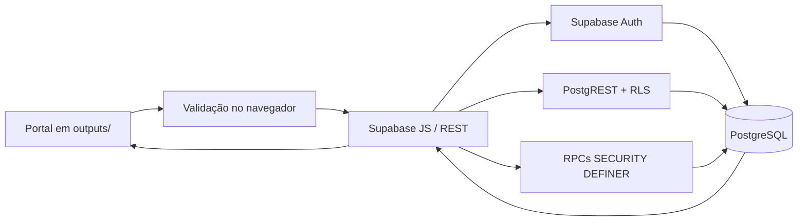

# Auditoria de persistência do Portal Potala

**Data:** 18/09/2026

**Escopo:** fluxos do portal e do `/admin` que dependem de autenticação, API e banco de dados.

**Estado deste documento:** diagnóstico anterior às correções desta auditoria.

## 1. Resumo executivo

O produto servido ao usuário é o portal estático em `outputs/`. Ele usa **Supabase Auth + PostgreSQL/PostgREST/RPC**, por meio do SDK `@supabase/supabase-js` 2.57.4 e de um cliente REST pequeno para as páginas públicas. O diretório `app/`, o `db/schema.ts` vazio e a configuração SQLite/Drizzle pertencem ao starter de desenvolvimento e não são o backend do Portal Potala.

O portal não é apenas uma maquete: conta, perfil, histórico, salvos, conteúdo da home, blog e operação administrativa possuem caminhos reais até o Supabase. As leituras públicas e as negativas de acesso privado foram verificadas contra o projeto remoto. Também há problemas concretos: funções e coluna de senha legadas continuam no schema, embora os grants perigosos tenham sido revogados; comentários e contadores do blog não têm chave estrangeira para o post; alguns erros secundários são engolidos; a edição administrativa não detecta sobrescrita concorrente; a operação administrativa guarda documentos JSON e depende de validação de domínio no navegador; uploads próprios ainda não existem.

Não foram encontrados `service_role`, senha, chave privada ou token administrativo no bundle público. A única chave embutida é a chave publicável do Supabase, que depende de RLS e grants — comportamento esperado para o SDK no navegador.

## 2. Arquitetura encontrada

- **Frontend efetivo:** HTML, CSS e módulos JavaScript em `outputs/`.
- **Preview local:** `scripts/serve-outputs.mjs`.
- **Banco efetivo:** PostgreSQL hospedado no Supabase, projeto `gotrumwuimpoeggwamut`.
- **Autenticação:** Supabase Auth por e-mail e senha; confirmação de e-mail está habilitada.
- **Autorização:** RLS nas tabelas pessoais e função `public.is_portal_admin()` para conteúdo e operação.
- **Migrations:** `supabase/migrations/*.sql`.
- **ORM/SDK:** Supabase JS no produto. Drizzle está instalado no starter, mas o schema está vazio e não participa do Portal.
- **Operação administrativa:** `op_records`, `op_meta` e `op_requests`; o navegador calcula a mudança de domínio e `op_apply()` a aplica atomicamente com revisão e idempotência.
- **Conteúdo:** `home_blocks` publicados e `home_block_drafts` para rascunhos.
- **Blog:** tabelas próprias e RPCs de gravação, participação e visualização.

## 3. Inventário de tabelas

| Tabela | Finalidade | PK | FKs e relações | Campos importantes | Uso no código | Situação |
|---|---|---|---|---|---|---|
| `auth.users` | Identidade, senha e sessão do Supabase | `id uuid` | origem para `users.id` e `profiles.user_id` | e-mail, metadados, confirmação | adaptador Supabase de conta | Ativa; fonte correta de credenciais |
| `users` | Papel administrativo do usuário autenticado | `id uuid` | `id -> auth.users`, cascade | `email`, `name`, `role`, `active`; `password_hash` legado | `is_portal_admin()` e login do admin | Ativa, mas `password_hash` é duplicação obsoleta |
| `admin_users` | Relação administrativa antiga | `user_id uuid` | `user_id -> auth.users` | `role` | somente migrations antigas | Obsoleta/duplicada; não há uso atual no runtime |
| `profiles` | Perfil pessoal do visitante | `id uuid` | `id -> auth.users`, cascade | nome, avatar e dados de perfil | Meu Potala e sessão | Ativa; RLS por `auth.uid()` |
| `saved_items` | Itens salvos por conta | `id uuid` | usuário lógico por `user_id` | `user_id`, `content_type`, `content_id`, `created_at`, metadados | botões Salvar e Meu Potala | Ativa; unique por usuário/conteúdo e RLS |
| `history_items` | Histórico persistente de visita | `id uuid` | usuário lógico por `user_id` | tipo, referência, título, href, `visited_at`, metadados | `conta/rastro.js` e Meu Potala | Ativa; uma linha por visita relevante, com dedupe de 30 min no cliente |
| `followed_items` | Conteúdos/profissionais acompanhados | `id uuid` | usuário lógico por `user_id` | tipo, referência, notificações | Meu Potala | Ativa; RLS por usuário |
| `enrollments` | Inscrições do usuário | `id uuid` | usuário lógico por `user_id` | item, status, datas, metadados | Meu Potala | Ativa; conteúdo é polimórfico |
| `course_progress` | Progresso de curso | `id uuid` | usuário lógico por `user_id` | curso, posição/progresso, atualização | Meu Potala | Ativa |
| `schedule_items` | Agenda pessoal do usuário | `id uuid` | usuário lógico por `user_id` | item, início/fim, situação | Meu Potala | Ativa; distinta da agenda operacional |
| `notifications` | Notificações por conta | `id uuid` | usuário lógico por `user_id` | conteúdo, `read_at`, criação | Meu Potala | Ativa |
| `notification_preferences` | Preferências de notificação | `user_id uuid` | usuário lógico por `user_id` | canais e opções | Meu Potala | Ativa |
| `home_blocks` | Blocos publicados da home/jornada | `id text` | sem FK externa | slug, conteúdo, mídia, lado, posição, publicado, composição editorial | páginas públicas e editor | Ativa; leitura pública só de publicado |
| `home_block_drafts` | Rascunhos dos mesmos blocos | `id text` | espelho lógico de `home_blocks` | mesmos campos + `updated_at` | editor administrativo | Ativa; somente admin; publicação transacional |
| `blog_posts` | Posts e estado editorial | `id text` | nenhuma | slug, status, documento JSON, datas | blog público e mesa administrativa | Ativa; documento normalizado pelo domínio JS |
| `blog_settings` | Nome e capa do blog | `id integer` | nenhuma | `name`, `cover`, `updated_at` | blog público/admin | Ativa, singleton `id=1` |
| `blog_post_views` | Contador agregado por slug | `slug text` | **sem FK para posts** | `views`, atualização | artigo e métricas admin | Ativa; integridade referencial incompleta |
| `blog_comments` | Comentários e moderação | `id uuid` | **sem FK para posts** | `post_slug`, autor, corpo, status, revisão | blog público/admin | Ativa; pode ficar órfã ao excluir post |
| `newsletter_subscriptions` | Inscrições no boletim | `id uuid` | nenhuma | e-mail normalizado, origem, criação | blog público e métrica admin | Ativa |
| `site_interests` | Sinais de interesse/participação | `id uuid` | usuário/conteúdo lógicos | origem, tipo, referência, metadados | RPCs de participação | Ativa |
| `op_records` | Documentos operacionais por coleção e id | `(collection, id)` | referências ficam dentro do JSON | `document jsonb`, `updated_at` | salas, agenda, pessoas, inventário e financeiro | Ativa; flexível, sem FKs relacionais |
| `op_meta` | Revisão do snapshot operacional | chave fixa | nenhuma | `revision` | `op_snapshot()`/`op_apply()` | Ativa, interna às RPCs |
| `op_requests` | Idempotência/auditoria de comandos | `request_id uuid/text` | nenhuma | revisão, resposta, data | `op_apply()` | Ativa, interna às RPCs |

### Entidades operacionais dentro de `op_records`

As coleções atualmente representam salas, reservas/agenda, perfis operacionais, inventário por quantidade, patrimônio individual, movimentações, necessidades, pagamentos, despesas, repasses e auditoria. Elas compartilham uma única fonte de dados no snapshot; não existem tabelas paralelas por tela. Entretanto, as referências entre documentos não recebem proteção de FK pelo PostgreSQL.

Há dois conceitos chamados “perfil”: `public.profiles` é o perfil da conta do visitante; a coleção operacional `profiles` representa clientes/profissionais da operação. Hoje não existe vínculo formal entre eles. Isso evita expor dados administrativos ao portal, mas pode duplicar a mesma pessoa e exige uma relação opcional futura (`auth_user_id`) em vez de uma terceira entidade.

## 4. Matriz funcional verificada antes das correções

| Funcionalidade | Front | Backend/API | Banco | Persiste | Segurança | Status |
|---|---|---|---|---|---|---|
| Cadastro | Validação de nome/e-mail/senha | `auth.signUp` real | Auth + trigger de perfil | Fluxo implementado; teste remoto completo depende de caixa de e-mail | Senha fica no Auth | IMPLEMENTADO; confirmação real não executada nesta auditoria |
| Login/logout/sessão | Estados globais e eventos Auth | `signInWithPassword`, `signOut`, `getSession`, listener | Supabase Auth | SDK recupera sessão após reload | Token do SDK; nenhum token próprio | IMPLEMENTADO; credencial real não fornecida |
| Perfil | Ler e salvar | upsert pelo SDK | `profiles` | Sim pelo contrato e testes | RLS por `auth.uid()` | FUNCIONAL NO CÓDIGO; erro de leitura era ocultado |
| Isolamento A/B | UI troca o proprietário do estado | consultas sem `user_id` fornecido pelo cliente | policies usam `auth.uid()` | Sim por desenho | Negativas remotas anônimas verificadas | RLS VERIFICADA; teste remoto com duas contas pendente |
| Histórico | Registro automático em páginas/conteúdos | insert em coleção | `history_items` | Banco, não localStorage | RLS por usuário | FUNCIONAL; falha era silenciosa |
| Salvos | Salvar/remover e refletir estado | upsert/delete | `saved_items` | Banco; intenção pré-login é temporária | unique + RLS | FUNCIONAL POR TESTE DE CONTRATO; sessão real pendente |
| Meu Potala | Loading/sucesso/erro e cache por usuário | leituras paralelas | tabelas pessoais | Banco | RLS | IMPLEMENTADO |
| Blog público | Lista, artigo, comentários e newsletter | REST/RPC | tabelas `blog_*` | Sim; fallback empacotado só em falha de leitura | público limitado a publicados/aprovados | LEITURA REMOTA VERIFICADA |
| CRUD do Blog | Mesa e editor | SDK + `save_blog_post` | `blog_posts` e auxiliares | Sim | admin no banco | IMPLEMENTADO; CRUD remoto não executado sem conta admin |
| Blocos publicados | Render público | REST | `home_blocks` | Sim | somente publicados para anônimo | LEITURA REMOTA VERIFICADA |
| Rascunhos e publicação | Editor/drafts | SDK + RPC transacional | `home_block_drafts`/`home_blocks` | Sim | admin no banco | ACESSO ANÔNIMO NEGADO REMOTAMENTE; CRUD admin pendente |
| Reordenação de blocos | `position` no editor | replace/publish RPC | campo `position` | Sim pelo contrato | admin | IMPLEMENTADO; não executado remotamente |
| Operação `/admin` | Telas integradas | `op_snapshot`/`op_apply` | `op_*` | Sim, com revisão e idempotência | admin no RPC | NEGATIVA ANÔNIMA VERIFICADA; regras de domínio só no cliente |
| Uploads próprios | Seleção/URL de assets | Ausente | Sem bucket/policy no repositório | Não há upload | — | NÃO IMPLEMENTADO |
| Concorrência editorial | Sem aviso de conflito | last-write-wins | `updated_at` não é precondição | Última gravação vence | autorização correta | INCOMPLETO |

## 5. CRUD verificado

Legenda: **C** = comprovado por teste automatizado do adaptador/contrato; **R** = comprovado remotamente; **I** = implementação inspecionada, sem conta real para mutação; **—** = não se aplica.

| Recurso | Create | Read | Update | Delete |
|---|---:|---:|---:|---:|
| Conta Auth | I | I | I | — |
| Perfil | C | C | C | — |
| Histórico | C | C | — | C |
| Salvos | C | C | C | C |
| Blog público | C | R | — | — |
| Blog admin | C/I | C/I | C/I | C/I |
| Blocos publicados | C/I | R | C/I | C/I |
| Rascunhos | C/I | I | C/I | C/I |
| Operação administrativa | C/I | C/I | C/I | C/I |

Não se marcou como remotamente testado nenhum fluxo que exigia credenciais ou confirmação por e-mail indisponíveis no ambiente.

## 6. Dados simulados e armazenamento local

| Local | Conteúdo | Classificação |
|---|---|---|
| defaults de home e blog | conteúdo de recuperação quando a leitura pública falha | Correto como fallback; não escreve no banco |
| `front-demo.js` e páginas marcadas como demonstração | conteúdo/experiência visual | Intencional; não deve ser confundido com cadastro real |
| conta em modo demonstração | sessão e coleções falsas em `localStorage` | Correto porque a interface identifica o modo de teste |
| blog “acesso de teste” | posts/configuração em `localStorage` | Correto e isolado; não suja o blog real |
| intenção de salvar/seguir antes de confirmar login | `localStorage`, expira em 30 minutos | Temporário apropriado; item final vai ao banco |
| dedupe do histórico | `sessionStorage` por usuário e item | Apropriado; o histórico efetivo está no banco |
| preview do admin e handoff de navegação | `sessionStorage` | Efêmero apropriado |
| `potala.plantinha.v1` | estado da planta do rodapé | Experiência local deliberada, sem conta |
| token de sessão do Supabase | armazenamento padrão do SDK | Apropriado; não há senha armazenada pelo Portal |

Não foram encontrados IndexedDB ou cookies próprios relevantes. Os mocks de testes foram preservados.

## 7. Problemas encontrados

### Crítico

Nenhuma exposição crítica ativa foi reproduzida. As funções legadas de senha já estão negadas para `anon` e `authenticated` no banco remoto.

### Alto

1. **Modelo de senha administrativo duplicado.** `users.password_hash`, `verify_portal_password()` e `set_portal_user_password()` duplicam Supabase Auth. Os grants perigosos foram revogados, mas o schema mantém uma segunda fonte de credenciais e o README ainda orienta seu uso.
2. **Integridade operacional depende do navegador.** `op_apply()` garante admin, atomicidade, revisão e idempotência, porém aceita documentos JSON já calculados. Um cliente admin defeituoso ou adulterado consegue ignorar regras como conflito de sala e referências válidas.
3. **Uploads reais ausentes.** Blog, editor, perfil, cursos, atividades e profissionais usam URL/asset existente. Não existe fluxo de upload, bucket e policy versionados.

### Médio

1. `blog_comments.post_slug` e `blog_post_views.slug` não têm FK para `blog_posts.slug`; exclusões podem deixar órfãos.
2. Editor de blocos e blog não enviam uma versão esperada; dois admins podem sobrescrever a edição anterior sem aviso.
3. Falhas ao gravar histórico, contar leitura e carregar métricas/comentários do blog eram silenciosas.
4. `admin_users` é uma tabela duplicada e sem uso atual.
5. Conta do portal e pessoa operacional não têm vínculo opcional; a mesma pessoa pode ser recadastrada sem reconciliação.
6. Referências polimórficas de salvos, histórico e conteúdo relacionado não têm FK. Nos dois primeiros casos é uma escolha de modelo; ainda requer rotinas de limpeza ao excluir conteúdo.

### Baixo

1. `db/schema.ts`/Drizzle/SQLite induzem leitura arquitetural errada por pertencerem ao starter sem uso no Portal.
2. Não há tipos gerados do Supabase; o produto é JavaScript e normaliza dados manualmente, mas divergências de coluna dependem de testes de contrato.
3. O fallback visual do perfil não diferenciava perfil ausente de falha de rede/permissão para diagnóstico.

## 8. Segurança e políticas verificadas

Foram feitas requisições reais, somente leitura ou deliberadamente negadas, usando a mesma chave pública do portal:

- `home_blocks` publicados: **200**;
- `blog_posts` publicados: **200**;
- `blog_settings`: **200**;
- comentários aprovados: **200**;
- `profiles`, `saved_items`, `home_block_drafts`, `users`, `op_records`: **401 / 42501** sem sessão;
- RPCs administrativas `op_snapshot`, `save_blog_post`, `replace_home_blocks_editorial`: **401 / 42501**;
- RPCs legadas de senha: **401 / 42501**;
- signup por e-mail está ativo, confirmação de e-mail está ativa e Google está desabilitado.

As migrations de tabelas pessoais usam `auth.uid()` nas policies. As ações administrativas usam `is_portal_admin()` dentro do banco. Ocultar botões não é a proteção efetiva.

## 9. Migrations e reconstrução

O histórico versionado está em `supabase/migrations`, na ordem 20260902–20260917. O README registra aplicação remota. Não há Supabase CLI nem Docker neste computador; por isso não foi possível reconstruir localmente um PostgreSQL idêntico nesta etapa. A compatibilidade SQL é coberta por testes textuais/contratuais, e as policies essenciais foram comprovadas no banco remoto.

Há uma divergência documental: a migration mais recente revoga o uso das funções de senha, mas o README ainda manda chamar uma delas. Isso será corrigido junto da remoção da estrutura legada.

## 10. Baseline de testes

A suíte do portal executou **961 testes: 955 passaram e 6 falharam** antes de qualquer correção desta auditoria. As seis falhas são expectativas de CSS/HTML visual em `home-mobile-expansion`, `home-trajeto-html` e `prologo-titulo`; não envolvem banco, autenticação ou persistência. O log foi preservado em `.local/audit-test-baseline.log`.

## 11. Limites de comprovação

Não havia credencial de usuário/admin de teste nem acesso à caixa de confirmação. Portanto, esta auditoria não atribui “remotamente aprovado” a cadastro confirmado, login real, isolamento entre duas contas e mutações administrativas. Criar contas descartáveis sem poder confirmar ou limpar deixaria dados no ambiente e não provaria o fluxo completo. Esses cenários serão mantidos como pendentes, com testes automatizados de contrato e um roteiro de integração reproduzível.

## 12. Correções planejadas após este diagnóstico

1. Remover do schema futuro a senha paralela e atualizar a documentação para usar Supabase Auth.
2. Impedir novos órfãos no blog com relações versionadas e política de exclusão explícita.
3. Fazer falhas secundárias chegarem a um canal observável sem interromper a leitura.
4. Parar de mascarar falhas de métricas/comentários no painel e mostrar estado de erro.
5. Criar um verificador remoto somente leitura para grants, políticas públicas e exposição acidental.
6. Ampliar testes de sessão, histórico, blog e migrations antes de modificar as implementações.
7. Documentar como riscos restantes: validação operacional server-side, concorrência editorial, uploads e teste E2E real com duas contas.

## 13. Correções executadas após o diagnóstico

1. **Erros silenciosos:** recuperação da sessão, leitura de perfil, gravação de histórico e contagem de artigo agora informam um canal de diagnóstico. A leitura continua disponível quando o dado é secundário.
2. **Mesa do Blog:** leituras, comentários e inscrições são carregados em paralelo, mas falhas parciais deixam um alerta visível; números zerados não são mais apresentados como se fossem reais.
3. **Credencial única:** `202609180001_integridade_de_persistencia.sql` remove as duas funções legadas e `users.password_hash`. O README agora orienta Auth + papel em `public.users`.
4. **Integridade do Blog:** a mesma migration adiciona FKs `NOT VALID` de visualizações e comentários para o slug do post, com cascade em renomeação/exclusão. Novas linhas já são verificadas; a validação do legado fica condicionada ao diagnóstico de órfãos incluído na própria migration.
5. **Guarda da operação:** `202609180002_guarda_da_operacao.sql` limita o tamanho de cada documento e valida no PostgreSQL sala, status, modalidade, horário, capacidade e conflitos de sala/profissional. Isso protege chamadas diretas a `op_apply()`.
6. **Auditoria reproduzível:** `npm run audit:database` confere as leituras públicas e garante que tabelas/RPCs privadas continuam negadas para a chave anônima, sem executar escrita.

## 14. Arquivos alterados

- **Migrations:** `202609180001_integridade_de_persistencia.sql`, `202609180002_guarda_da_operacao.sql`.
- **APIs/adaptadores:** sessão, rastro de histórico e repositório público do Blog.
- **Componentes:** mesa administrativa do Blog, apenas no tratamento de indisponibilidade parcial.
- **Ferramenta:** `scripts/audit-supabase-public.mjs` e comando `audit:database`.
- **Documentação:** README e este relatório.
- **Testes:** conta/sessão, histórico, Blog, integridade das migrations, guarda operacional e auditor remoto.

## 15. Resultado final dos testes

- **242 testes focados em conta, conteúdo, Blog, Supabase e operação:** 242 passaram.
- **Auditoria remota anônima:** 11 verificações aprovadas; leituras públicas responderam 200 e recursos privados responderam 401/42501.
- **Suíte total:** 973 testes; 967 passaram e 6 falharam. As seis falhas são exatamente as mesmas do baseline anterior e tratam de CSS/HTML visual da Home, sem relação com esta auditoria.
- **Diff:** sem erros de whitespace em `git diff --check`.
- **Lint dedicado:** não executado porque as dependências locais do ESLint não estão instaladas; a tentativa via `npx` foi interrompida por não produzir resultado. Os módulos alterados foram importados/executados pela suíte Node.

## 16. Migrations ainda não aplicadas no remoto

As duas migrations de 18/09 foram criadas e testadas localmente, mas não foram aplicadas ao projeto remoto nesta execução: não há Supabase CLI, Docker ou sessão administrativa do banco disponível no ambiente. Até a aplicação, a revogação anterior continua protegendo as funções de senha, mas a remoção física, as FKs e o gatilho operacional ainda não existem no banco hospedado.

## 17. Pendências e riscos restantes

- Executar E2E remoto de cadastro confirmado, reload, logout/login e duas contas exige duas caixas de e-mail/credenciais descartáveis e acesso para limpar os registros depois.
- Aplicar e validar as duas migrations novas no Supabase.
- Fazer o levantamento de órfãos do Blog e então executar `VALIDATE CONSTRAINT`.
- Adicionar bloqueio otimista no Blog e no editor de blocos para avisar sobre edição concorrente; hoje a última gravação vence.
- Definir Supabase Storage, bucket e policies antes de oferecer upload. Hoje o editor trabalha com URLs e assets existentes.
- Relacionar opcionalmente um perfil operacional à conta Auth para reconciliar a mesma pessoa sem misturar dados privados e administrativos.
- Remover `admin_users` em uma migration posterior, após confirmar no remoto que todas as linhas já foram migradas para `users`.

## 18. Checklist final verificada

- [ ] Criação de conta — contrato automatizado aprovado; confirmação remota por e-mail não executada.
- [ ] Login — erros e contrato automatizados; login remoto real não executado.
- [x] Logout — fluxo automatizado aprovado.
- [ ] Persistência de sessão — SDK configurado/testado com `persistSession`; reload remoto real pendente.
- [ ] Perfil — leitura/escrita cobertas por adaptadores e RLS; ciclo remoto logout/login pendente.
- [x] Histórico — gravação no banco, dedupe, RLS e erro observável cobertos.
- [x] Salvos — upsert, remoção, identidade por conta e RLS cobertos.
- [x] Blog — leitura pública remota e contratos administrativos cobertos.
- [ ] Criar post — contrato da RPC coberto; mutação remota admin pendente.
- [ ] Editar post — contrato coberto; mutação remota e concorrência pendentes.
- [ ] Publicar post — regra de publicação coberta; E2E visitante pendente.
- [x] Editor do admin — repository, RLS e RPCs cobertos.
- [ ] Salvar blocos — contrato coberto; mutação remota admin pendente.
- [ ] Reordenar blocos — campo/contrato coberto; refresh remoto pendente.
- [ ] Upload de imagens — não implementado.
- [ ] Refresh mantém alterações — persistência é remota por arquitetura; ciclo real com credenciais pendente.
- [ ] Dados isolados por usuário — RLS e ausência de `user_id` controlado pelo cliente cobertas; teste remoto A/B pendente.
- [x] Permissões de admin — negação anônima remota e regras SQL cobertas.
- [ ] Banco consistente — novas proteções prontas, porém ainda não aplicadas/validadas no remoto.
- [x] Migrations atualizadas — duas migrations versionadas e testadas.
- [ ] Testes passando — 242/242 do escopo passam; a suíte total mantém 6 falhas visuais preexistentes.
